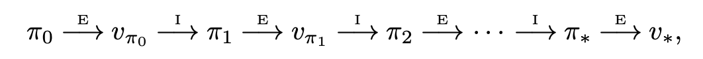

# Policy Iteration

pi policysi iyileştirildiğinde elde ettiğimiz pi’ tekrar değerlendirip onu da improve edebiliriz. Böylelikle evaluation-improvement döngüsü dediğimiz bir döngüye sahip oluruz.

Böylece monotonik şekilde iyileşen policyler elde ediyor oluruz.

Her bir improvement bir önceki policynin daha kötü veya eşit olduğunu garantiler.

Böyle bir şekilde optimal planı bulmaya policy iteration deriz.

Her bir policy değerlendirmesi, kendi içinde iteratif bir hesaplamadır, ve önceki policynin value fonksiyonuyla başlar.

Bu da policy evaluationın yaklaşma hızını arttırır.