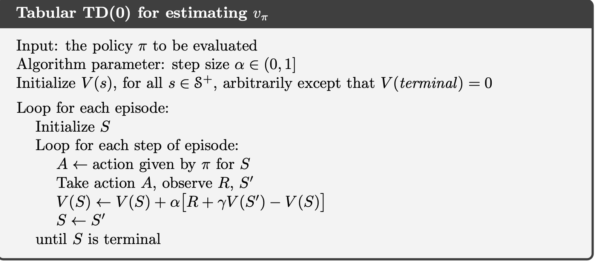
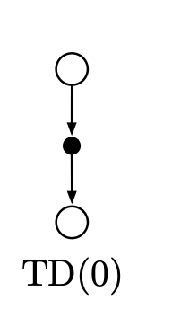

# Ch6.1 - TD Prediction

Given some experience following a policy pi, both MC and TD update their estimate V of v_pi for the S_t occuring in that experience.

Monte Carlo methods wait until the return following the visit is known, then use that return as a target for V(S_t).

A simple every-visit MC method for non-statinoary environments is 

$V(S_t) \larr V(S_t) + \alpha[G_t - V(S_t)]$ (6.1)

Whereas MC methods wait till the end of the episode, TD methods need to wait only until the next timestep t+1. 

At the next time step they form a target and make a useful update using observed reward and the estimate of $V(S_{t+1})$. The simplest TD method makes the update

$V(S_t) \larr V(S_t) + \alpha[R_{t+1} + \gamma S_{t+1} - V_t]$ (equation 6.2)

immediately on transition to S_t+1 and receiving R_t+1.

This method is called TD(0) or one-step TD, because it is a special case of $TD(\lambda)$ and n-step TD methods that will be developed.

Here is the algorithm for TD(0).

Because TD(0) bases its update on an existing estimate, we say that it is a bootstrapping method, like DP.

$V_\pi(s) = E_\pi[G_t|S_t = s]$ (equation 6.3)

= $E_\pi[R_{t+1} + \gamma G_{t+1} |S_t = s]$

= $E_\pi[R_{t+1} + \gamma v_\pi(S_{t+1}) |S_t = s]$ (equation 6.4)

Roughly, MC methods use an estimate of eq 6.3 as a target because it samples return and uses it in place of the real expected return. 

DP methods use an estimate of eq 6.4 not because of the expected values, which completely provided by the model, but because $v_\pi(S_{t+1})$ is not known and current estimate is used instead.

The TD target is an estimate for both reasons, thus includes the aspects of both MC and DP. It combines the sampling of MC with the bootstrapping of TD. 

- Back-up Diagram for TD(0)
    
    
    
    Back-up diagram for tabular TD(0) is shown. Value estimate for the state node at the top of the back-up diagram is updated on the basis of **one** sample transition from it to the immediately following state.
    
    We refer to TD and MC updates as sample updates because they involve looking ahead to a sample successor state, using the value of the successor and the reward along the way to computa backed-up value.
    
    Sample updates differ from expected updates of DP methods, because they are based on a single sample successor rather than on a complete distribution of all possible successors.
    

The quantity in the brackets for the TD(0) update rule measures the difference between estimated value and the better estimate. This quantity called TD-error.

$V(S_t) \larr V(S_t) + \alpha[R_{t+1} + \gamma S_{t+1} - V_t]$ (equation 6.2)

$[R_{t+1} + \gamma S_{t+1} - V_t]$ TD- Error

Notice TD error at each time is the error in the estiamate made at that time.

Because TD error depends on the next state and reward, it is not actually available until one time step later. That is $\delta_t$ is the error in $V(S_t)$ available at time t+1.